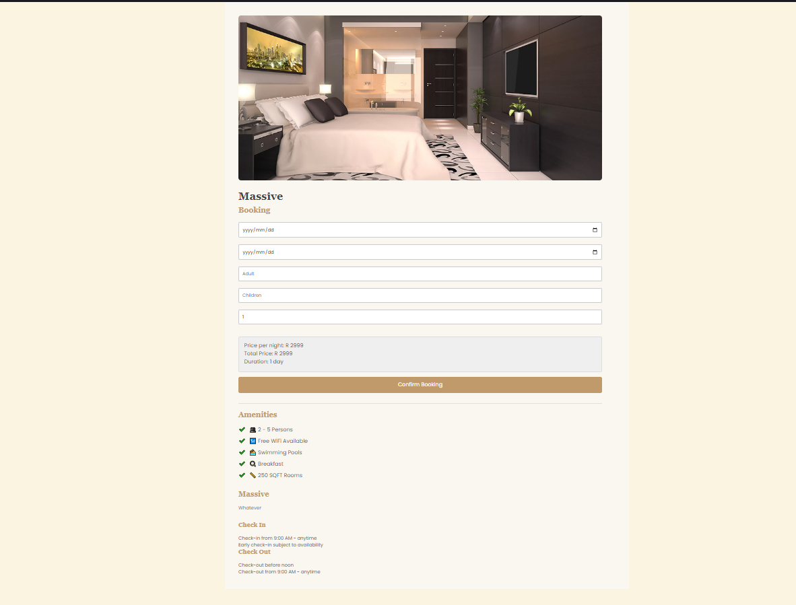

<h1 align="center"> GitPoint </h1>  

  

  GitHub in your pocket. Built with React Native.

  
  

<!-- START doctoc generated TOC please keep comment here to allow auto update -->
<!-- DON'T EDIT THIS SECTION, INSTEAD RE-RUN doctoc TO UPDATE -->
## Table of Contents
- [Introduction](#introduction)
- [Features](#features)

<!-- END doctoc generated TOC please keep comment here to allow auto update -->

## Introduction

View repository and user information, control your notifications and even manage your issues and pull requests. Built with React Native, GitPoint is one of the most feature-rich unofficial GitHub clients that is 100% free.

<!-- **Av.**

  

 -->

## Features

A few of the things you can do with GitPoint:

- View user activity feed
- Communicate on your issue and pull request conversations
- Close or lock issues
- Apply labels and assignees
- Review and merge pull requests
- Create new issues
- Star, watch and fork repositories
- Control your unread and participating notifications
- Easily search for any user or repository

  

  

