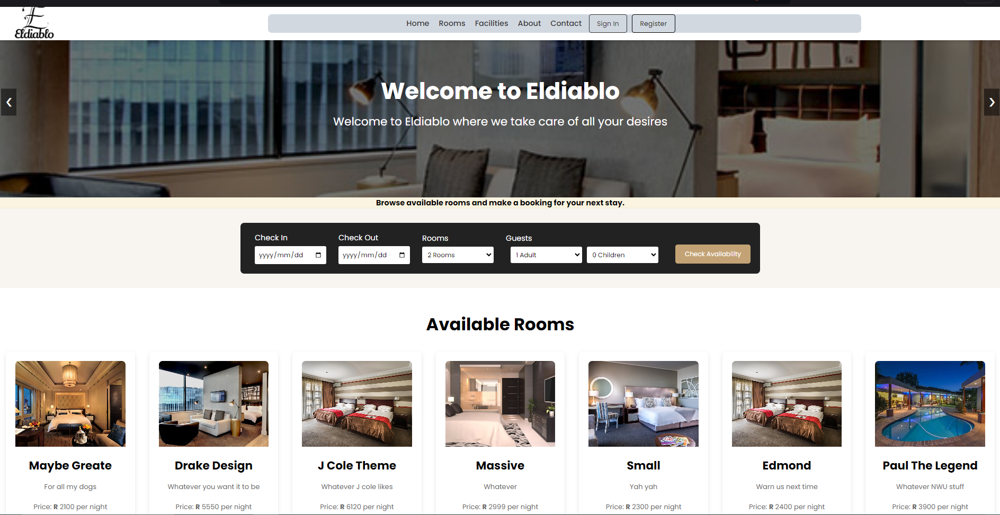

<h1 align="center"> HOTEL APP </h1>  

## Table of Contents

- [Introduction](#introduction)
- [Features](#features)
- [Images](#images)

## Introduction

This is a hotel app

## Features

A few of the things you can do with Hotel App:

- User Authentication: Users can register and log in using Firebase Authentication.
- Users can view a list of available accommodations.
- Users can book accommodations.
- Payments via Stripe
- Admin
  - Admins can add new accommodations with details like room type, capacity, price, availability, etc.
  - Admins can view reservations, including check-in and check-out dates, guest details, room details

## Images

